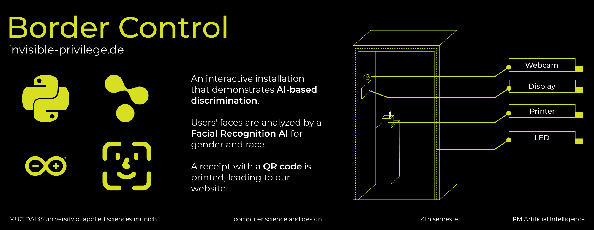
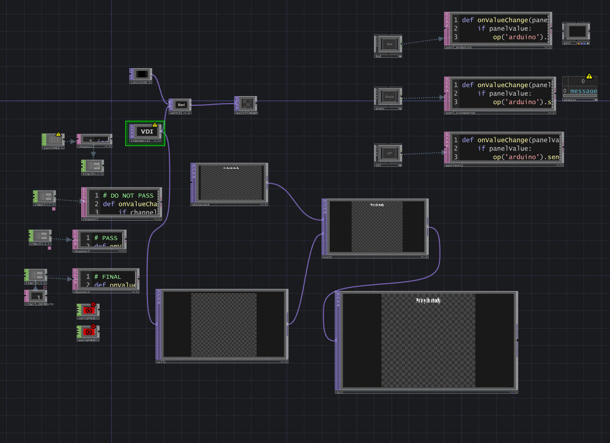

## Introduction

This project was created by students of the University of Applied Sciences Munich. The goal is to raise awareness of discrimination through an interactive installation that demonstrates how AI-based discrimination works.

## Components

### Hardware

-   Booth styled as a body scanner
-   Camera for face detection
-   Small touch display for face preview
-   LEDs controlled via Arduino
-   MAME arcade button as a USB joystick
-   Thermal printer (we used EPSON TM-T20II) for printing receipts with QR code

### Software

-   Python backend
-   Flask for the web server
-   DeepFace for face analysis
-   PIL and win32print for printing
-   qrcode for QR code generation

## Setup

### Prerequisites

-   Python 3.8 or higher
-   Arduino IDE with the connected leds (see ledarduino.ino) 
-   Flask
-   DeepFace
-   Pillow
-   pywin32
-   qrcode

### Installation

1.  Clone the repository:    
    `git clone https://github.com/wiesty/invisible-privilege.git`
    ` cd invisible-privilege` 
    
2.  Install the dependencies:
    
    `pip install -r requirements.txt` 
    
3.  Ensure the printer is installed and configured:
    
    -   Change the `PRINTER_NAME` in `backend.py` to match your printer's name.

### Running the Project

1.  Start the Flask server:
    
    `python backend.py`   
    
2.  The server analyzes the image at `img/captured_face.0.jpg`. Ensure the image is present before calling the analysis.  
    
3.  Start the touchdesigner File `main.toe` 
       
     Edit the following layers to your needs:
       
     `videodevin1` - camera to scan the face
     `joystick1` - to start the process by pressing b1
     `audioplay1 & audioplay2` - sounds that will be played after the process
     `arduino` - com port of the connected arduino 
          
    
      
    
4.  The touchdesigner file will call the flask backend to analyze the camera/image and print the results.
 

## License

This project is licensed under the MIT License. See the `LICENSE` file for details.